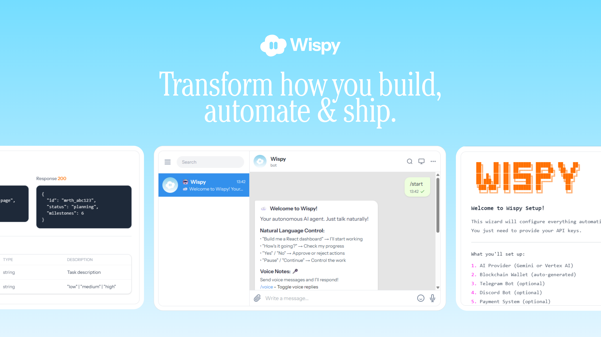

<p align="center">
  
</p>

<h1 align="center">Wispy — Agentic Commerce on SKALE</h1>

<p align="center">
  <strong>An AI Agent That Can Spend Money on the Internet by Itself</strong>
</p>

<p align="center">
  <a href="https://dorahacks.io/hackathon/x402"></a>
  <a href="https://www.npmjs.com/package/wispy-ai"></a>
  <a href="https://opensource.org/licenses/MIT"></a>
  <a href="https://nodejs.org"></a>
  <a href="https://www.typescriptlang.org"></a>
  <a href="https://github.com/hausorlabs/wispy"></a>
</p>

<p align="center">
  <a href="#what-we-built">What We Built</a> &middot;
  <a href="#track-coverage">Tracks</a> &middot;
  <a href="#hackathon-implementation">Implementation</a> &middot;
  <a href="#run-the-demo">Run Demo</a> &middot;
  <a href="#architecture">Architecture</a> &middot;
  <a href="https://wispy.cc">Website</a>
</p>

---

## SF Agentic Commerce x402 Hackathon — SKALE Labs

> **Hackathon**: [SF Agentic Commerce x402](https://dorahacks.io/hackathon/x402) | **Dates**: Feb 11–14, 2026 | **Prize Pool**: $50,000
>
> **Team**: [Hausor Labs](https://hausorlabs.tech) — Brian Mwai, Joy C. Langat

---

## What We Built

Wispy is an **autonomous AI agent** powered by Google Gemini 2.5 Pro that can **discover, evaluate, pay for, and consume** paid services on the internet — entirely on its own.

During the hackathon, we built a complete **agentic commerce integration** on SKALE's BITE V2 Sandbox that covers all 5 tracks:

1. **The agent finds a paid API** — discovers services behind HTTP 402 paywalls
2. **It decides if it's worth paying** — evaluates cost vs. budget with spending controls
3. **It pays with crypto** — signs EIP-3009 USDC authorizations, routed through Kobaru facilitator
4. **It encrypts sensitive transactions** — uses BITE v2 BLS threshold encryption so validators can't see the `to` or `data` fields until consensus
5. **It produces a full audit trail** — every payment logged, every decision tracked, every receipt stored

No human intervention. No manual approvals for micro-payments. The agent manages its own wallet, respects its spending policy, and chains multiple paid calls to complete complex tasks.

---

## Track Coverage

| Track | Prize | What Wispy Demonstrates | Key Files |
|-------|-------|------------------------|-----------|
| **1. Overall Best Agent** | $9,500 | End-to-end: discover paid API → decide ROI → pay with USDC → deliver result → audit trail | [`demo/scenarios/track1-overall.ts`](src/integrations/agentic-commerce/demo/scenarios/track1-overall.ts) |
| **2. x402 Tool Usage** | $7,000 | Chained x402 calls with EIP-3009 signed authorizations, budget-aware spending, per-call tracking | [`x402/buyer.ts`](src/integrations/agentic-commerce/x402/buyer.ts), [`x402/tracker.ts`](src/integrations/agentic-commerce/x402/tracker.ts) |
| **3. AP2 Integration** | $7,000 | Intent → Cart → Payment → Receipt mandate chain with failure handling and rollback | [`ap2/flow.ts`](src/integrations/agentic-commerce/ap2/flow.ts) |
| **4. DeFi Agent** | $3,000 | Multi-source research via Algebra DEX subgraphs, risk engine with guardrails, on-chain swaps | [`defi/swap.ts`](src/integrations/agentic-commerce/defi/swap.ts), [`defi/risk-engine.ts`](src/integrations/agentic-commerce/defi/risk-engine.ts) |
| **5. Encrypted Agents (BITE v2)** | $4,500 | BLS threshold encryption of transactions, conditional execution, on-chain verification | [`bite/encrypted-tx.ts`](src/integrations/agentic-commerce/bite/encrypted-tx.ts) |

---

## Hackathon Implementation

> **All hackathon code lives in: [`src/integrations/agentic-commerce/`](src/integrations/agentic-commerce/)**
>
> **25 TypeScript files | 4,470 lines of code | 46 tests passing | 0 TypeScript errors**

### Directory Breakdown

```
src/integrations/agentic-commerce/
│
├── config.ts                        # SKALE BITE V2 chain config, Algebra DEX contracts + ABIs
│
├── x402/                            # Track 2: x402 Protocol
│   ├── buyer.ts                     # HTTP 402 detection → EIP-3009 USDC authorization → retry with proof
│   ├── seller.ts                    # Mock x402 seller endpoints for demo services
│   └── tracker.ts                   # Per-call spend tracking, daily audit ledger, budget enforcement
│
├── ap2/                             # Track 3: AP2 Protocol
│   ├── mandates.ts                  # Intent / Cart / Payment mandate objects
│   ├── receipts.ts                  # Payment receipts + transaction records
│   └── flow.ts                      # AP2 orchestration engine (mandate chain with rollback)
│
├── defi/                            # Track 4: DeFi Agent
│   ├── swap.ts                      # Algebra DEX integration (SwapRouter + QuoterV2), direct USDC fallback
│   └── risk-engine.ts               # Position limits, volatility checks, slippage controls
│
├── bite/                            # Track 5: Encrypted Agents
│   ├── encrypted-tx.ts              # BITE v2 BLS threshold encryption, on-chain submit + verify
│   └── conditional.ts               # Conditional execution: time-lock, delivery-proof, oracle gates
│
├── demo/                            # Live Demo Infrastructure
│   ├── server.ts                    # Launches mock x402 services (weather, sentiment, report, price)
│   ├── runner.ts                    # Runs all 5 track demos end-to-end
│   ├── verify.ts                    # On-chain verification utilities
│   └── scenarios/
│       ├── track1-overall.ts        # Full agent commerce lifecycle
│       ├── track2-x402.ts           # Chained x402 paid API calls
│       ├── track3-ap2.ts            # AP2 mandate flow demo
│       ├── track4-defi.ts           # DeFi research + swap demo
│       └── track5-bite.ts           # BITE encrypted transaction demo
│
├── tests/                           # 46 Tests (vitest)
│   ├── ap2-flow.test.ts
│   ├── bite-encrypt.test.ts
│   ├── integration.test.ts
│   ├── risk-engine.test.ts
│   └── tracker.test.ts
│
├── index.ts                         # Integration entry: 11 agent tools registered into Wispy
└── README.md                        # Detailed integration documentation
```

### How Each Protocol Works

**x402 Payment Flow (Track 2):**
```
Agent makes HTTP request → Server returns 402 Payment Required
→ Agent reads price from x402 headers → Checks budget policy
→ Signs EIP-3009 USDC authorization → Sends to Kobaru facilitator
→ Facilitator settles on SKALE → Agent retries request with payment proof
→ Server validates receipt → Returns paid content → Agent logs spend
```

**AP2 Mandate Chain (Track 3):**
```
Agent creates INTENT mandate ("I need weather data")
→ Service responds with CART mandate (items + pricing)
→ Agent creates PAYMENT mandate (signed USDC authorization)
→ Service creates RECEIPT mandate (delivery confirmation)
→ Any step can fail → automatic rollback and retry with budget adjustment
```

**BITE v2 Encryption Flow (Track 5):**
```
Agent encrypts transaction fields (to + calldata) with BLS threshold keys
→ Submits encrypted tx to SKALE BITE magic address
→ Transaction is opaque in mempool — no MEV, no front-running
→ Validators cooperatively decrypt during consensus (2t+1 threshold)
→ Agent verifies decryption via bite_getDecryptedTransactionData RPC
```

**DeFi Agent Flow (Track 4):**
```
Agent queries Algebra DEX subgraph for pool data
→ Checks on-chain liquidity via Factory.poolByPair()
→ Runs risk engine (position limits, slippage, volatility)
→ Executes swap via SwapRouter.exactInputSingle() or falls back to direct USDC transfer
→ Logs trade decision with reason codes and risk score
```

### Agent Tools (11 Registered)

The integration registers 11 tools into Wispy's tool system, making them available to the AI agent during conversations and autonomous tasks:

| Tool | Track | Description |
|------|-------|-------------|
| `x402_pay_and_fetch` | 1, 2 | Access paid APIs via x402 with automatic payment |
| `x402_check_budget` | 1, 2 | Check daily budget, spending limits, remaining allowance |
| `x402_audit_trail` | 1, 2 | Full payment audit trail with per-call breakdown |
| `ap2_purchase` | 3 | AP2 mandate flow: intent → cart → payment → receipt |
| `ap2_get_receipts` | 3 | Retrieve AP2 transaction records |
| `defi_research` | 4 | Multi-source market research via Algebra subgraphs |
| `defi_swap` | 4 | Risk-controlled token swap on Algebra DEX |
| `defi_trade_log` | 4 | Trade decisions with reason codes and risk scores |
| `bite_encrypt_payment` | 5 | BITE v2 BLS threshold encryption of transactions |
| `bite_check_and_execute` | 5 | Conditional execution of encrypted transactions |
| `bite_lifecycle_report` | 5 | Encrypted payment lifecycle report |

---

## Run the Demo

```bash
# Clone the repo
git clone https://github.com/hausorlabs/wispy.git
cd wispy

# Install dependencies
npm install

# Start mock x402 services (weather, sentiment, report, price data)
npx tsx src/integrations/agentic-commerce/demo/server.ts

# Run all 5 track demos (in another terminal)
npx tsx src/integrations/agentic-commerce/demo/runner.ts

# Run with real on-chain BITE transactions (requires funded wallet)
AGENT_PRIVATE_KEY=0x... npx tsx src/integrations/agentic-commerce/demo/runner.ts

# Run individual tracks
npx tsx src/integrations/agentic-commerce/demo/scenarios/track5-bite.ts

# Run tests (46/46 passing)
npx vitest run src/integrations/agentic-commerce/tests/
```

### Environment Variables

| Variable | Required | Description |
|----------|----------|-------------|
| `AGENT_PRIVATE_KEY` | For on-chain | Hex private key for the agent wallet (EIP-3009 signing) |
| `SELLER_PRIVATE_KEY` | No | Hex private key for mock seller (auto-generated if not set) |
| `GEMINI_API_KEY` | For AI | Google Gemini API key for the agent's reasoning engine |

---

## Network & Contracts

| Component | Value |
|-----------|-------|
| **Chain** | SKALE BITE V2 Sandbox (Chain ID: `103698795`) |
| **RPC** | `https://base-sepolia-testnet.skalenodes.com/v1/bite-v2-sandbox` |
| **USDC** | `0xc4083B1E81ceb461Ccef3FDa8A9F24F0d764B6D8` |
| **Facilitator** | `https://gateway.kobaru.io` |
| **Gas** | Free (SKALE is gasless) |
| **Algebra SwapRouter** | `0x3012E9049d05B4B5369D690114D5A5861EbB85cb` |
| **Algebra QuoterV2** | `0x03f8B4b140249Dc7B2503C928E7258CCe1d91F1A` |
| **Algebra Factory** | `0x10253594A832f967994b44f33411940533302ACb` |
| **BITE Magic Address** | `0x42495445204D452049274d20454e435259505444` |

---

## Architecture

### Agentic Commerce Layer

```
┌─────────────────────────────────────────────────────────────────────┐
│                    WISPY AGENTIC COMMERCE                           │
├─────────────────────────────────────────────────────────────────────┤
│                                                                     │
│   AI Agent (Gemini 2.5 Pro)                                        │
│   ┌──────────────────────────────────────────────────────────┐     │
│   │  "Find weather data, pay for it, encrypt the payment"    │     │
│   └──────────────┬───────────────────────────────────────────┘     │
│                  │                                                   │
│   ┌──────────────▼───────────────────────────────────────────┐     │
│   │              11 Agent Tools                               │     │
│   │  x402_pay_and_fetch │ ap2_purchase │ defi_swap │ bite_*  │     │
│   └──────┬──────────┬──────────┬──────────┬─────────────────┘     │
│          │          │          │          │                         │
│   ┌──────▼────┐ ┌───▼────┐ ┌──▼─────┐ ┌─▼──────────┐            │
│   │  x402     │ │  AP2   │ │  DeFi  │ │  BITE v2   │            │
│   │  Buyer    │ │ Mandate│ │  Swap  │ │  Encrypted │            │
│   │  + Track  │ │ Chain  │ │ Engine │ │  Commerce  │            │
│   └──────┬────┘ └───┬────┘ └──┬─────┘ └─┬──────────┘            │
│          │          │          │          │                         │
│   ┌──────▼──────────▼──────────▼──────────▼─────────────────┐     │
│   │           SKALE BITE V2 Sandbox (Gasless)                │     │
│   │  USDC │ Algebra DEX │ BITE BLS Encryption │ Kobaru      │     │
│   └─────────────────────────────────────────────────────────┘     │
│                                                                     │
└─────────────────────────────────────────────────────────────────────┘
```

### Wispy Platform (Pre-existing)

Wispy is a full autonomous AI agent platform with:

- **Marathon Mode** — Multi-day autonomous task execution with checkpointing
- **27+ Built-in Tools** — File ops, web scraping, browser automation, image generation
- **Multi-Channel** — CLI, Telegram, WhatsApp, REST API, WebSocket
- **ERC-8004 Identity** — On-chain agent registration on Base Sepolia
- **A2A Protocol** — Agent-to-agent communication (Google)
- **Memory System** — SQLite + vector embeddings for persistent context

The agentic commerce integration plugs into this platform as a first-class integration, registering its 11 tools alongside Wispy's existing 27+ tools.

---

## Tech Stack

| Component | Technology |
|-----------|-----------|
| **AI Agent** | Wispy (TypeScript, Google Gemini 2.5 Pro) |
| **Blockchain** | SKALE BITE V2 Sandbox |
| **Payments** | x402 protocol (EIP-3009 signed USDC) |
| **Wallet** | viem + @x402/evm |
| **DEX** | Algebra Integral v1.2.2 (concentrated liquidity) |
| **Encryption** | BITE v2 BLS threshold encryption (@skalenetwork/bite) |
| **Authorization** | AP2 mandate protocol |
| **Runtime** | Node.js 20+, TypeScript 5.7, ESM |
| **Testing** | vitest (46 tests) |
| **Mock Services** | Express.js + @x402/express |

---

## Hackathon Build Log

| Day | Date | What We Built |
|-----|------|---------------|
| **Day 1** | Feb 11 | SKALE chain config, x402 buyer/seller/tracker, wallet setup, dependency integration |
| **Day 2** | Feb 12 | AP2 mandate chain, BITE v2 encrypted transactions, DeFi swap engine with Algebra DEX |
| **Day 3** | Feb 13 | Integration loader (11 tools), 5-track demo scenarios, 46 tests, demo infrastructure |
| **Day 4** | Feb 14 | Documentation, CHANGELOG, README, submission polish |

---

## Deployed Contracts

| Contract | Address | Network |
|----------|---------|---------|
| Agent Registry | [`0x158B236CC840FD3039a3Cf5D72AEfBF2550045C7`](https://sepolia.basescan.org/address/0x158B236CC840FD3039a3Cf5D72AEfBF2550045C7) | Base Sepolia |
| USDC (Sandbox) | `0xc4083B1E81ceb461Ccef3FDa8A9F24F0d764B6D8` | SKALE BITE V2 Sandbox |
| Algebra SwapRouter | `0x3012E9049d05B4B5369D690114D5A5861EbB85cb` | SKALE BITE V2 Sandbox |
| Algebra Factory | `0x10253594A832f967994b44f33411940533302ACb` | SKALE BITE V2 Sandbox |

---

## License

[MIT](LICENSE)

---

<p align="center">
  <strong>Wispy</strong> is built by <a href="https://hausorlabs.tech">Hausor Labs</a>
</p>

<p align="center">
  <a href="https://wispy.cc">wispy.cc</a> &middot;
  <a href="https://docs.wispy.cc">docs</a> &middot;
  <a href="https://www.npmjs.com/package/wispy-ai">npm</a> &middot;
  <a href="https://github.com/hausorlabs/wispy">GitHub</a>
</p>
